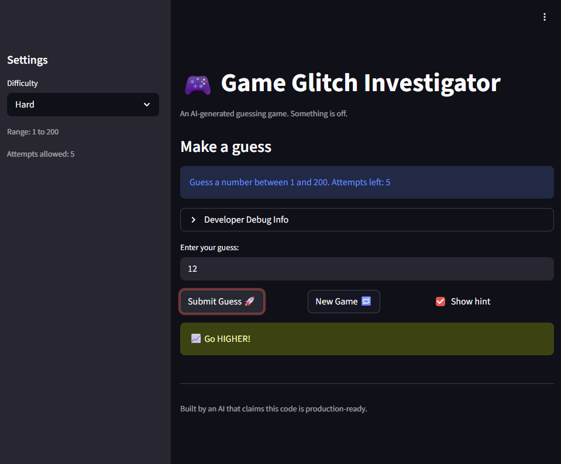
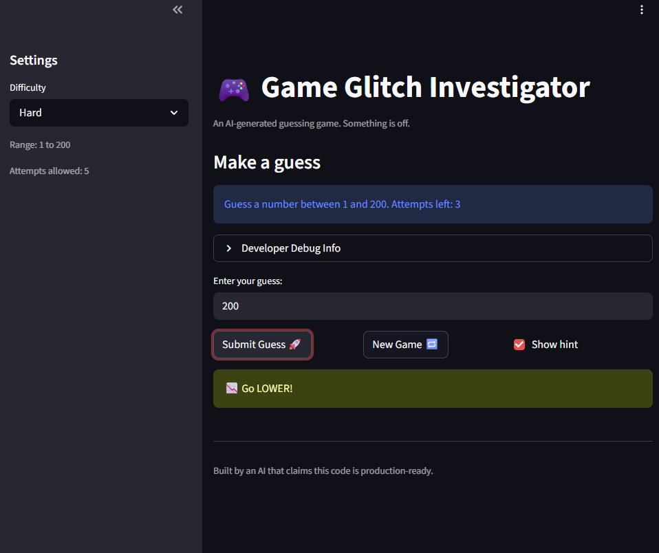
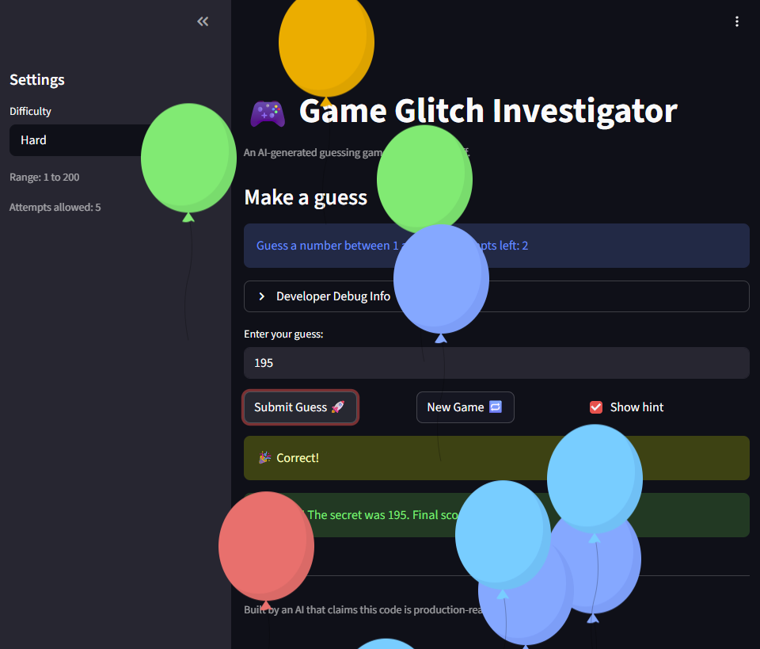
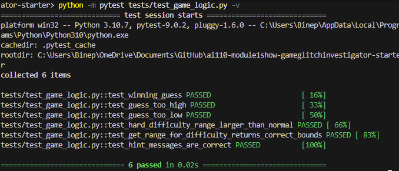

# 🎮 Game Glitch Investigator: The Impossible Guesser

## 🚨 The Situation

You asked an AI to build a simple "Number Guessing Game" using Streamlit.
It wrote the code, ran away, and now the game is unplayable. 

- You can't win.
- The hints lie to you.
- The secret number seems to have commitment issues.

## 🛠️ Setup

1. Install dependencies: `pip install -r requirements.txt`
2. Run the broken app: `python -m streamlit run app.py`

## 🕵️‍♂️ Your Mission

1. **Play the game.** Open the "Developer Debug Info" tab in the app to see the secret number. Try to win.
2. **Find the State Bug.** Why does the secret number change every time you click "Submit"? Ask ChatGPT: *"How do I keep a variable from resetting in Streamlit when I click a button?"*
3. **Fix the Logic.** The hints ("Higher/Lower") are wrong. Fix them.
4. **Refactor & Test.** - Move the logic into `logic_utils.py`.
   - Run `pytest` in your terminal.
   - Keep fixing until all tests pass!

## 📝 Document Your Experience

**Game Purpose:**
This is a number-guessing game built with Streamlit where players guess a secret number between a difficulty-dependent range (Easy: 1-20, Normal: 1-100, Hard: 1-200). The game provides hints ("Go Higher"/"Go Lower"), tracks attempts and score, and has different difficulty levels with varying attempt limits.

**Bugs Found:**
1. Hard difficulty range (1-50) was easier than Normal (1-100) - fixed to 1-200
2. Range display was hardcoded to "1 and 100" instead of showing actual difficulty bounds
3. "New Game" button ignored difficulty setting and always used 1-100 range
4. Hint messages were backwards (said "Go Higher" when should say "Go Lower")
5. Game over message didn't disappear after clicking "New Game"
6. Secret was being converted to string on even attempts, causing type comparison errors

**Fixes Applied:**
- Updated `get_range_for_difficulty()` to return proper ranges for each difficulty
- Made display text dynamic using `f"Guess a number between {low} and {high}"`
- Fixed "New Game" button to use `random.randint(low, high)` from current difficulty
- Corrected hint logic in `check_guess()` to show "Go LOWER" when guess > secret
- Added `st.session_state.status = "playing"` reset in New Game handler
- Removed string conversion hack and simplified `check_guess()` for consistent integer comparisons
- Refactored all game logic into `logic_utils.py` and added 6 automated pytest tests (all passing)

## 📸 Demo

**Screenshot of Fixed, Winning Game:**

**Test Results:**

All 6 tests pass:
- ✓ test_winning_guess
- ✓ test_guess_too_high  
- ✓ test_guess_too_low
- ✓ test_hard_difficulty_range_larger_than_normal
- ✓ test_get_range_for_difficulty_returns_correct_bounds
- ✓ test_hint_messages_are_correct

## 🚀 Stretch Features

- [ ] [If you choose to complete Challenge 4, insert a screenshot of your Enhanced Game UI here]
